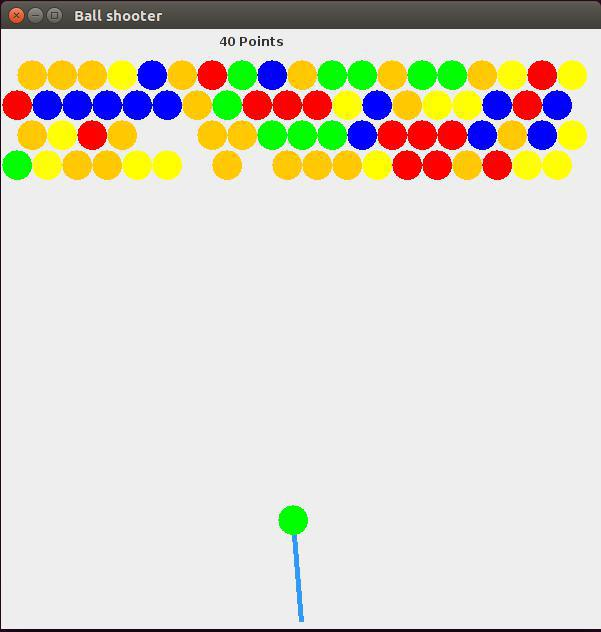

## Bumble Game written in Java

To execute this game you have to have installed jre.

```bash

$ java -jar BumbleGame.jar
```


### Screenshot



### How to play

 - With the mouse you move the stick that grabs the ball.
 - With left mouse click you shoot the ball.
